# __Kubernetes__

This section contains `k8s` manifests created to work with the application
from `online_inference` section. The `README` shows the results of my experiments.

__VK Cloud Platform__ was used to host the cluster (it is really nice of them
to provide a trial with free balance for testing!). After signing up for their platform I
created a cluster with 2 worker nodes and a single master node. They provide a `kubeconfig` file
to access the cluster in CLI. Moreover, `VSCode` has an extension for k8s with a nice UI.
I could have used `Lens` to monitor and configure the cluster, but it would have implied much headache
as I primarily work through WSL2.

### __Cluster at VK Cloud Solutions__

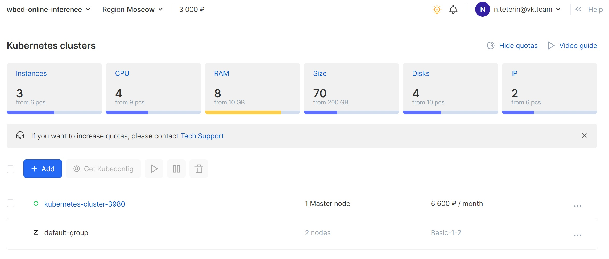

### __Connecting to the cluster__

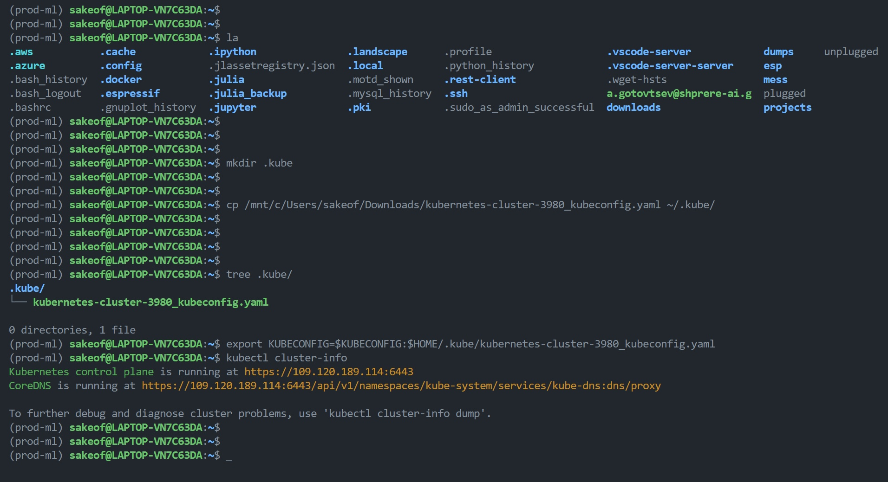

### __Creating the first Pod__

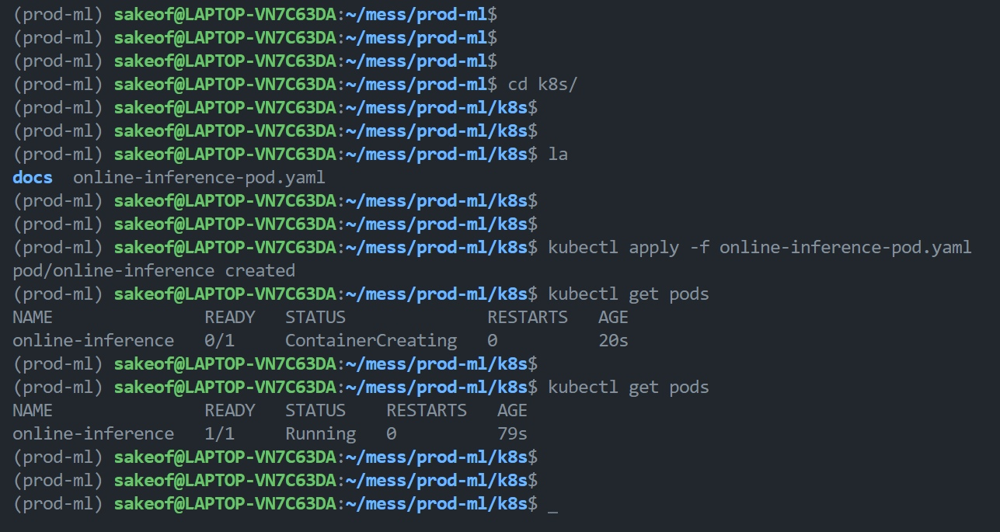

As the second step, manifest was modified to sleep for about half a minute before launching the server.
Then, a simple trick was used to cause an error and `pod` was stopped.

### __Pods with ConfigMap__

Kubernetes encourages one to separate the data from application logic. For instance,
`pod` can be configured on startup through envars or mounted config files. The prior may be looked up
from `ConfigMap` entity, a key-value storage for non-sensitive information:

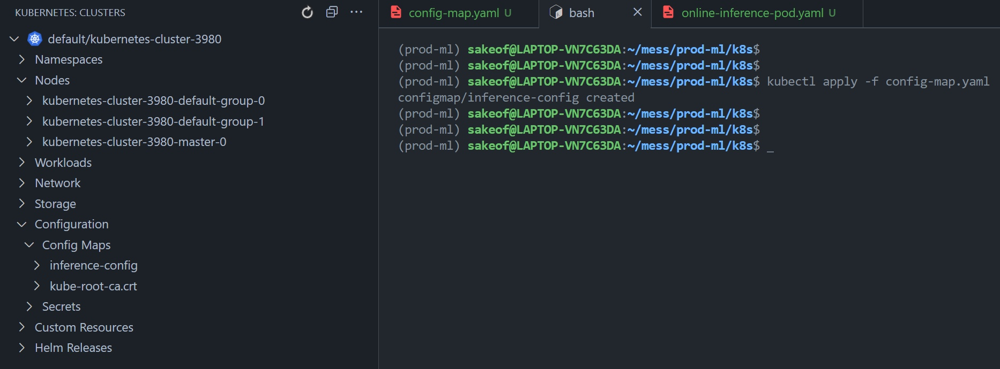

### __SSH tunelling and port forwarding__

With k8s extension for `VSCode` it was quite easy to terminal into the running pod and therefore
access its internals (say, logs). For such debugging purposes it is appropriate, however, tunelling
or port forwarding into pods is generally discouraged and considered a bad practice.

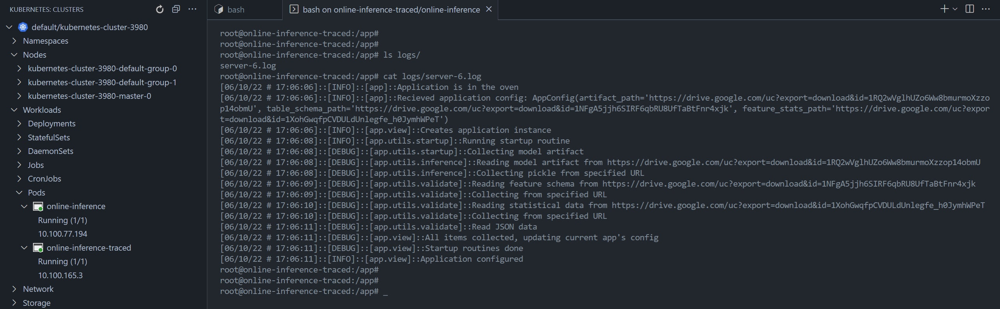


### __ReplicaSets and probes__

I encountered a weird bug during debugging the probes API: the URL for data stored in my google drive
turned out to be inaccessible from the pods, which prevented them from passing healthchecks.
It is weird as the same URLs were ok earlier, I guess that Google Drive API considers me trying to DDoS it, lol.

As I have already started interacting with VKCS, creating an s3 ice bucket seemed to be a good idea.
Current application does not support the s3 protocol, however, the files are accesed via public direct links.

`online-inference-configured.yaml` contains an example of application with delayed startup (simulating db connection
initialization or other long-lasting resource aquisition types). The app itself is run in a daemon mode (note the `&`) and
pod is aborted with an attempt to open a non-existent file after the actual startup. This leads to k8s trying to restart the
pod again and again, as the liveness probe fails.

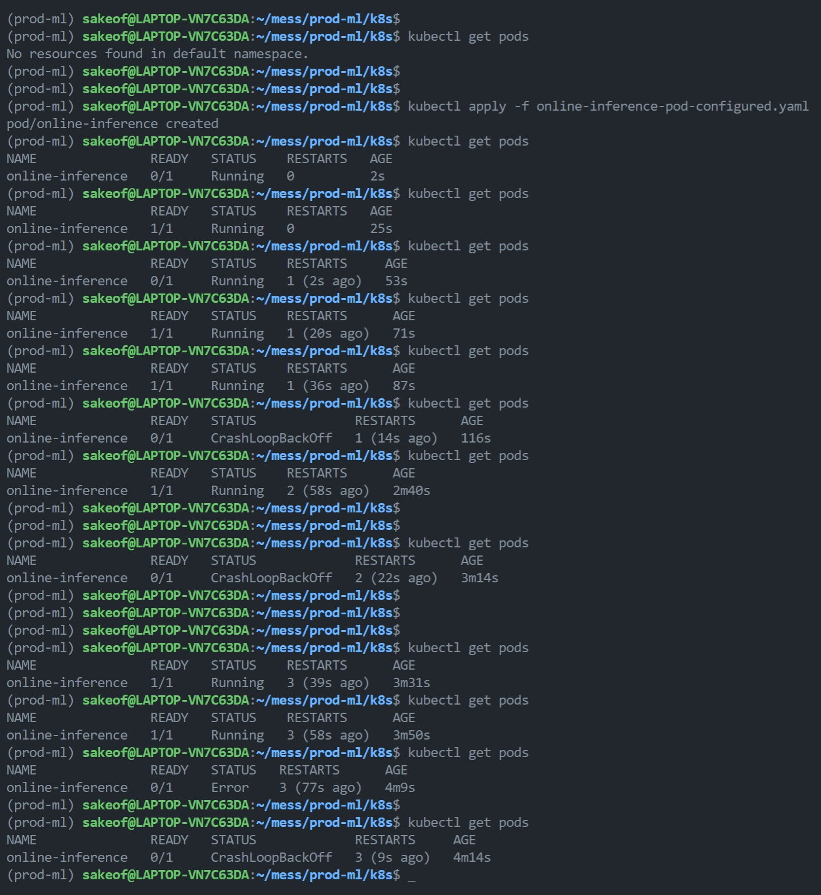

Replica set had some highlights aswell: given 2 worker nodes and a limit of `500m CPU`, the third pod just
did not start and was tagged as `scheduled` indefinitely (logs said that the CPU limits were insufficient).
However, after reducing this limit to `250m` all the containers were up and running.

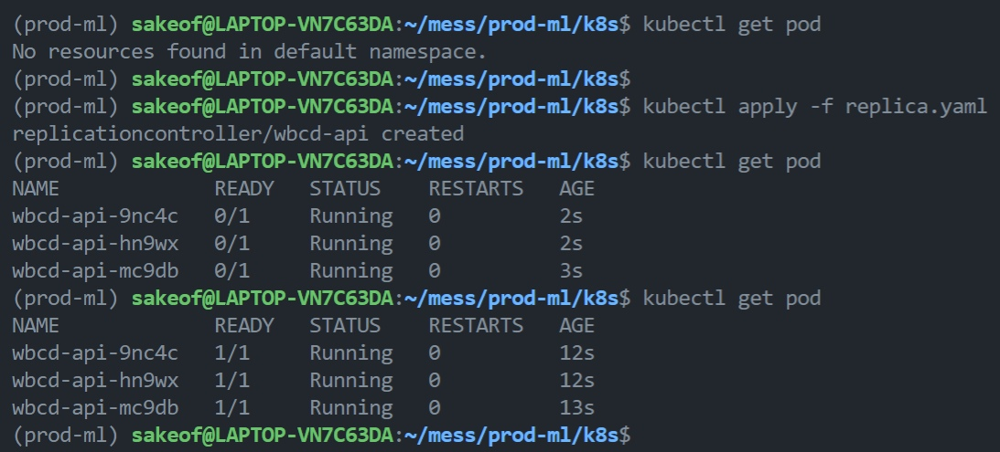

Manual scaling for replicas works in the following way:

1. Given a bigger number of pods and another `container` specs (say, image version), `NewPodCount - CurrentPodCount` new pods
will be spawned so that the total number of pods fits the new requested amount.
1. Given a smaller number of pods, in contrary, replica set will merely kill several pods so that the final pod number
fits the requested amount too.

That is when deployments enter the game: they provide us with opportunity to dynamically update specs of containers in
an expected way.

### __Deployments and rollout strategies__

By default k8s use so called `RollingUpdate` strategy, which implies creation of extra pods during an update.
This provides better accesibility but is costly in terms of time and hardware (see `rolling-deployment.yaml`).

One can adjust this behavior with `maxSurge` and `maxUnavailable` parameters and change the rollout strategy
to `Recreate` with the according `type` value. When recreating, all of the old pods are killed at once,
and new pods supersede them at once too (see `recreate-deployment.yaml`).

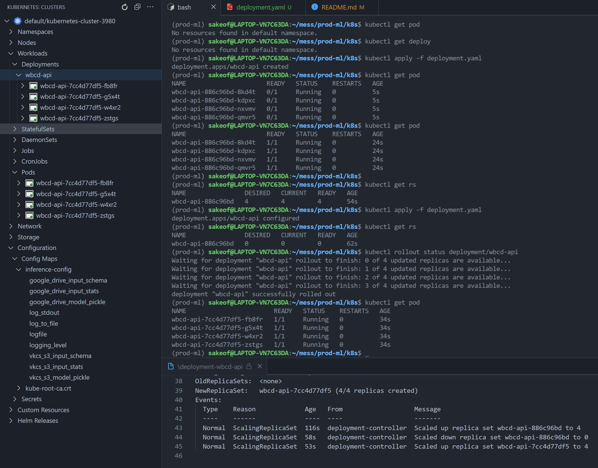

In order to achieve the situation when all pods from previous and new replicas are present, one should
set `maxSurge` to the new pod count and `maxUnavailable` to zero, note the event log in the screenshot below:
(__Note:__ the manifest name was changed later for better readability. It can be found at `green-blue-deployment.yaml`)

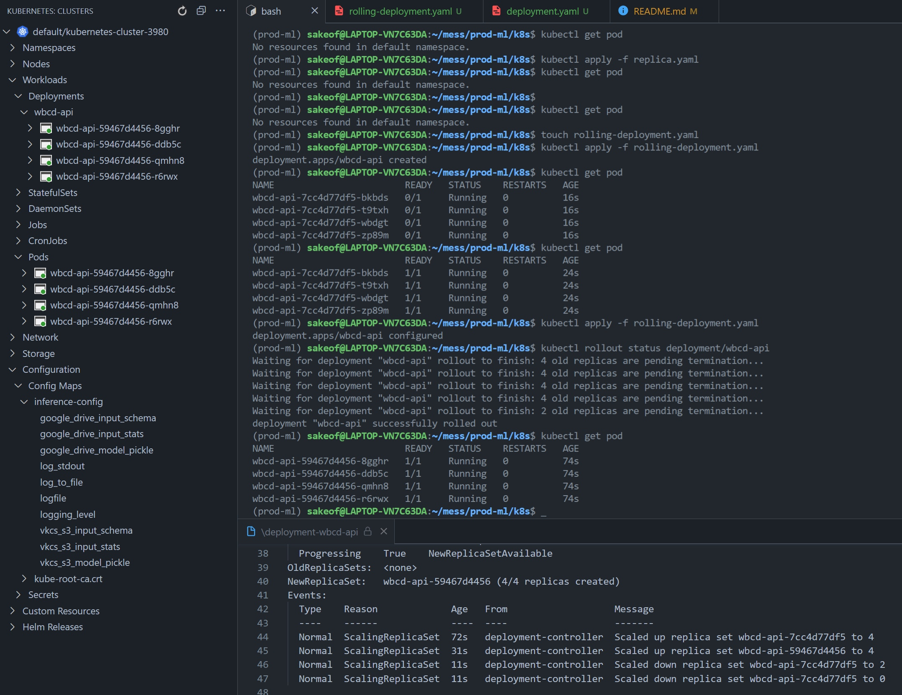

In order to achieve the case when pods are superseded one by one, `maxUnavailable` should be set to zero, but `maxSurge` must be 1.
Note the event log in deployment description:

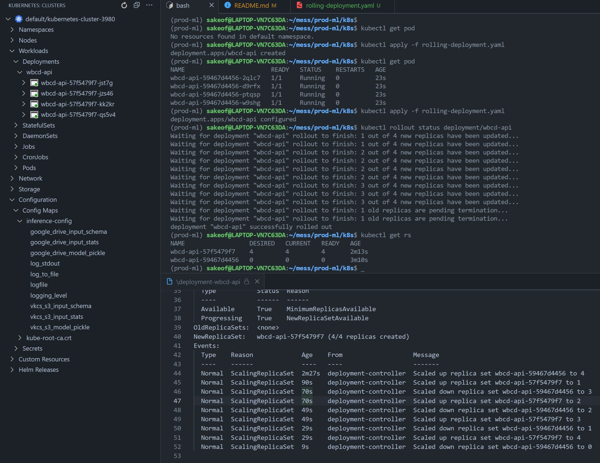


### __Ingress Controllers and Services__

In order to access the pods externally, one should create a resource called `Service`. There are 4 primary types of services, but a common practice is creating one with a default type (`--type=ClusterIP`, non-routable) and forward the incoming requests to the underlying deployment/pods through a `LoadBalancer` service. There may be many balancers, but another good practice is to use so called `Ingress` resource with rules for an ingress controller. Ingress controller is a `LoadBalancer` service accessible externally which serves as a proxy. In this project, `nginx` balancer was used. One can create rules for the balancer to forward incoming requests to a specific `Service`. See `wbcd-service.yaml` and `ingress-hosts.yaml` for details. It is possible and common to use ingress with a hostname, so that your apllications are accessible through ordinary human-readable names. As there was no domain name when I was playing with the cluster, all the incoming traffic for cluster's public IP got redirected.

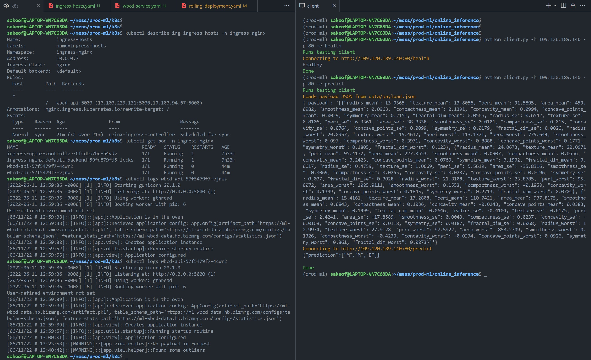

### __Kubernetes cheatsheet__

```
export KUBECONFIG=$KUBECONFIG:$HOME/<config-path>
kubectl cluster-info
kubectl get pod (alias for pods)
kubectl get ing (alias for ingress)
kubectl get ns (alias for namespaces)
kubectl get deploy -n <namespace> (alias for deployment)
kubectl get all
kubectl apply -f <manifest.yaml>
kubectl delete -f <manifest.yaml>
kubectl logs <ingress-nginx-controller-pod> -n <ingress-nginx-namespace>
kubectl describe <resource, like pod, node or deployment>
kubectl config set-context --current --namespace=<namespace-name> (to omit -n flags)
```

To access k8s Dashboard:
```
kubectl proxy
kubectl get secret $(kubectl get sa dashboard-sa -o jsonpath='{.secrets[0].name}') -o jsonpath='{.data.token}' | base64 --decode
```

You will probably have to run these commands in separate shells as the first one blocks

Then paste the obtained token in the dashboard UI at
http://localhost:8001/api/v1/namespaces/kube-system/services/https:kubernetes-dashboard:/proxy/#/workloads?namespace=default

The token expires sometimes thus one may have to rerun the last command to get new token
Note that get secret should be run at the `default` namespace/context, otherwise one may face the following result:

```
Error from server (NotFound): serviceaccounts "dashboard-sa" not found
```
