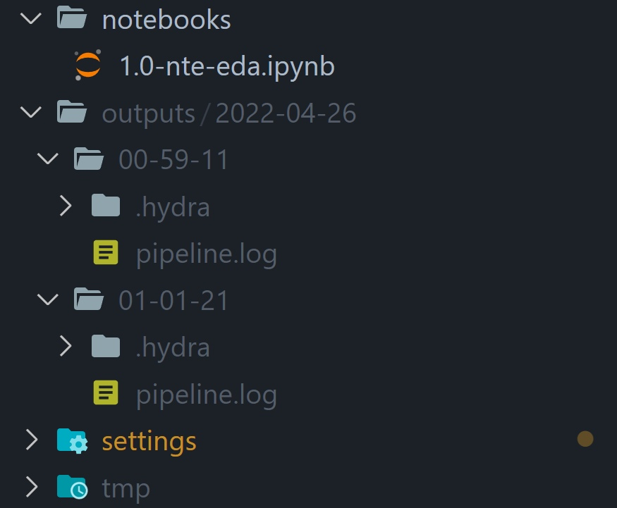
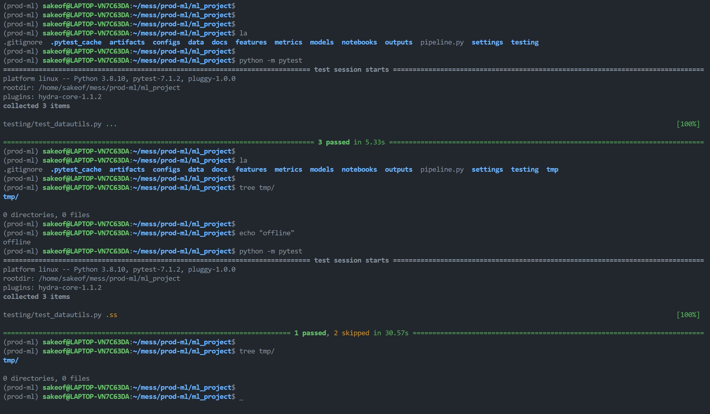

# __Basic usage__

## __Run the training pipeline with hydra__
In directory `ml_project`, run the following command: 

`>>> python3 pipeline.py`

After this, `outputs/` dir should be automatically created by hydra to manage runs.



__Note__: due to relative pathing, the paths convention is `../../../desired-dir-name`.

__Upd__: now `${dir_prefix}` variable can be used to manage pathing in configs.

## __Configure the pipeline!__
With hydra it is really simple and straightforward, just specify the required configuration
throgh the CLI like `estimator=random-forest` or `++random_state=42` (use `++` to override existing values).

## __Logging__
Loggers are used in most modules and the logfile can be found in hydra's `outputs/` directory as `pipeline.log`.

## __Unit-testing__
`Pytest` framework is used for testing, modular tests can be found at `testing/` directory. I tried to advance
my knowledge of pytest by using `mark.skipif` semantics in order to manage offline runs for data fetching.
Also, I found out that `pytest` has its own `setup` and `teardown` methods. Those were used in order to
create a temporary directory to write/read data during testing. The directory is cleaned up after each run.

In order to run all unit-tests, run the following command (see the example below):

`>>> python -m pytest`



## __Evaluation__

To evaluate the model pipeline in terminal, run the following command:

```python evaluate.py model_artifact=*artifact-path* input=*inference-features-csv*```

In this command, `model_artifact` arg should be a path to the pipeline pickle created by `pipeline.py`
and `input` should be a valid path to inference features (stored in a `.csv` file).

Note that these arguments are required, otherwise the application will abort.
