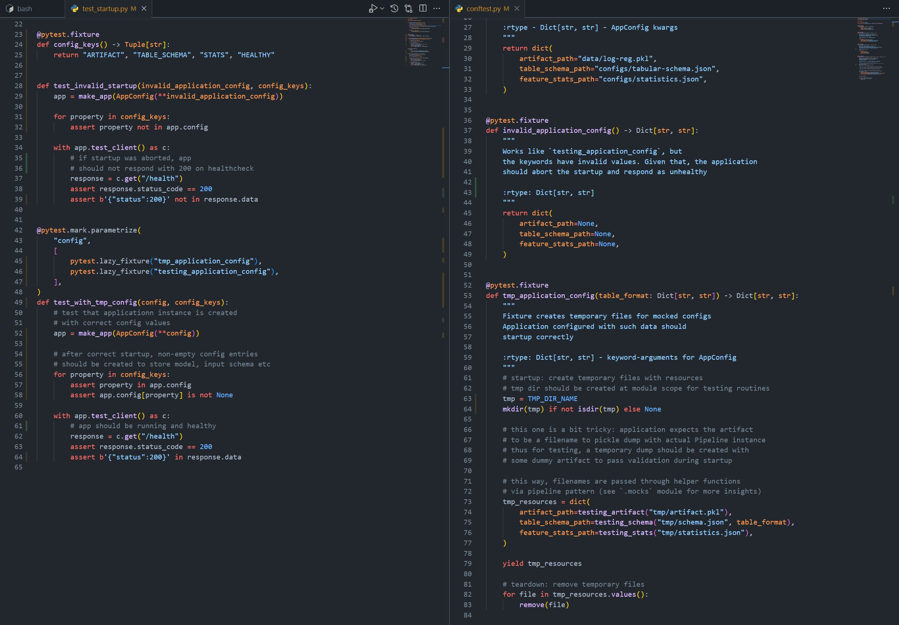

# __Basic Usage__

## __Run Flask backend manually__

First, make sure you have your dependencies installed with the following command from the top-level directory of the project:

```
$ pip install -r requirements.txt
```

Flask application then can be run from `online_inference` dir as follows:

```
$ flask run
```

Server is configured using environmental variables, and by default, flask will try to locate `.env` and `.flaskenv` files in the running directory. Below the used envars are listed with some default values:

```
LOGFILE="server.log"
ARTIFACT="data/log-reg.pkl"
TABLE_SCHEMA="configs/tabular-schema.json"
STATS="configs/statistics.json"
```

Make sure that the application can access the required files, otherwise it will continue working but write encountered errors in the specified `LOGFILE` (app is writing to `server.log` by default).

## __Check if the application has start up correctly__

Server has `/health` endpoint (use with __GET__ request) which can be used to check whether the application is ready to handle incoming requests to predict.

## __Responses__

Server responses with the following signature:

```
{"status": 200 (or 400 on error), "body": {...}}
```

## __Input format__

Application expects the incoming requests for `/predict` endpoint to contain `payload` parameter which has a value of __JSON-encoded string__

Consider the following example with testing client:


Testing client can be run from the same location as the backend and has and expects the following arguments:

```
-h, --host (string) - server host (127.0.0.1 by default)
-p, --port (int) - server port
-d, --data (string) - local path to JSON with payload
```

Sample payload can be found at `data/payload.json`, which is the default value of `data` argument for convenience.

## __Run application in Docker__

The next step is to wrap the server into a `Dockerfile` and run with `docker-compose`

One may find corresponding files in the server root directory. App is run in the container using `gunicorn` server. At current design, all the data (model artifact, statistics, input schema) are collected during `image` build as the application expects local filenames for data sources. It would be a nice idea to separate the data collection during startup from the local filesystem.

In order to build the image locally and run it, use:

```
$ docker-compose up
```

## __Pytest+Flask__

Unit/functional tests for the server were implemented using `pytest`.
These utilize several nice practices like test parametrization with `pytest-lazy-fixture` for DRY and
yielding fixtures for separate startup/teardown routines like temporary file creation.
Consider the example below:



`Flask` can ease testing routines with `test_client()` method
of application instances, which in turn yield object with `get()`/`post()` methods
acting like an actual service client.

In order to run all tests, use:

```
$ python -m pytest
```
