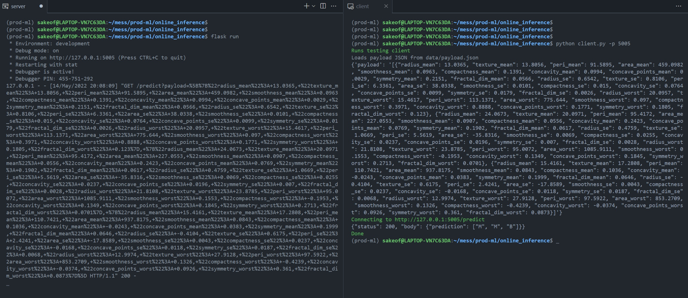

# __Basic Usage__

## __Run Flask backend manually__

First, make sure you have your dependencies installed with the following command from the top-level directory of the project:

```
>>>pip install -r requirements.txt
```

Flask application then can be run from `online_inference` dir as follows:

```
flask run
```

Server is configured using environmental variables, and by default, flask will try to locate `.env` and `.flaskenv` files in the running directory. Below the used envars are listed with some default values:

```
LOGFILE="server.log"
ARTIFACT="data/log-reg.pkl"
TABLE_SCHEMA="configs/tabular-schema.json"
STATS="configs/statistics.json"
```

Make sure that the application can access the required files, otherwise it will continue working but write encountered errors in the specified `LOGFILE` (app is writing to `server.log` by default).

## __Check if the application has start up correctly__

Server has `/health` endpoint (use with __GET__ request) which can be used to check whether the application is ready to handle incoming requests to predict.

## __Responses__

Server responses with the following signature:

```
{"status": 200 (or 400 on error), "body": {...}}
```

## __Input format__

Application expects the incoming requests for `/predict` endpoint to contain `payload` parameter which has a value of __JSON-encoded string__

Consider the following example with testing client:



Testing client can be run from the same location as the backend and has and expects the following arguments:

```
-h, --host (string) - server host (127.0.0.1 by default)
-p, --port (int) - server port
-d, --data (string) - local path to JSON with payload
```

Sample payload can be found at `data/payload.json`, which is the default value of `data` argument for convenience.

## __Run flask application in Docker (WIP)__

The next step is to wrap the server into a `Dockerfile` and run with `docker-compose`
